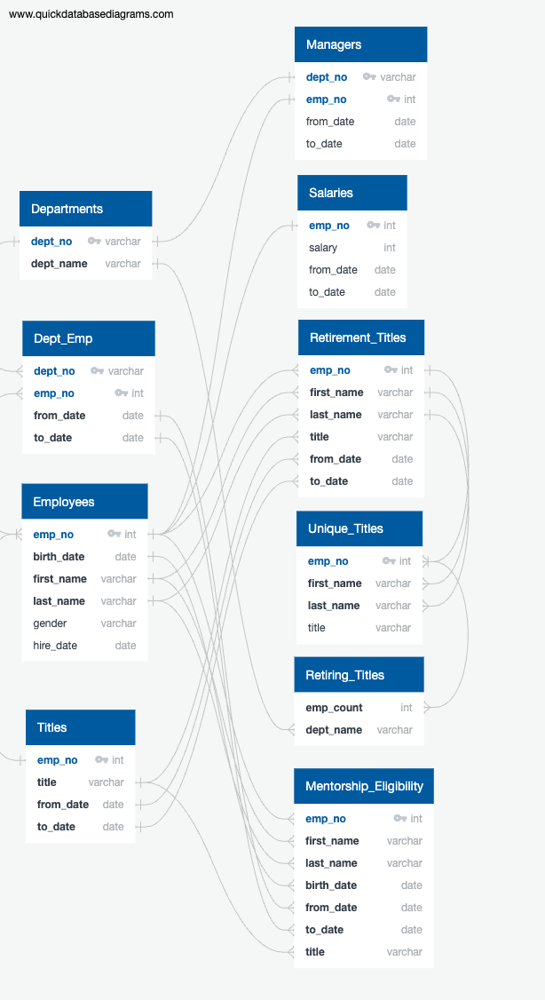

# An Investigation of Upcoming Retirements at Pewlett Hackard

## Overview of The Analysis
As a very large company that employs over 300,000 people, Pewlett-Hackard is looking ahead to plan for the impact of upcoming retirements over the next three years. These retirements will not onyl result in vacancies to be filled, but also a loss of skills and knowledge if the company does not take action to ensure their transfer from retirees to current employees and new hires. Therefore, this analysis of Pewlett-Hackard employee data was undertaken to determine the scale of upcoming retirements both company-wide and within title classes as well as identifying key employees who can serve as mentors throughout this transition.

## Results
* The data required to complete this analysis came from the Departments, Dept_Emp, Employees, and Titles datasets Bobby was originally supplied with, as visualized in the below Entity Relational Diagram created using [QuickDBD](quickdatabasediagrams.com)

* The length of the unique_titles is 72,458 indicating Pewlett-Hackard can expect that many employees to retire in the next three years.

* Of the expected 72,458 expected likely retirees, 50,842 of them hold a senior title. These employees have acquired vast skills and knowledge that need to be passed on to current and new employees before retirement.

* Over 1500 employees were identified to potentially take part in the new mentorship program designed to facilitate the transfer of the knowledge and skills of imminent retirees to current and new employees.
## Summary

This analysis has answered the questions of how many employees Pewlett-Hackard should expect to retire in the next three years (a whopping 72,458), which titles they hold (the majority of which are senior roles), and identifying over 1500 employees that can serve as mentors throughout the transition. In order to gain a more complete picture of the impact the company can expect from the 'Silver Tsunami,' the company should further investigate the following:

* The combined salaries of imminent retirees across departments as part of budget planning for hiring replacements

* A broader birth-date filter for the mentorship eligibilty table, given that only 0.5% of Pewlett-Hackard's employees were identified as potentially eligible for the mentorship program. Pewlett-Hackard should consider whether this number of employees is really adequate to absorb the knowledge of over 70,000 imminent retirees.